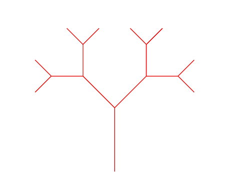
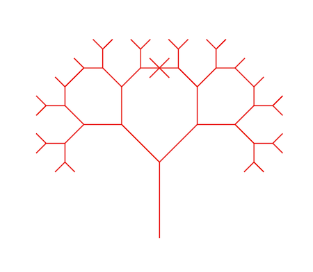
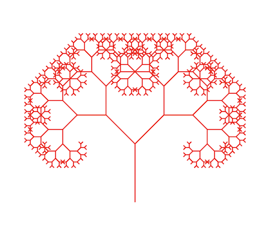
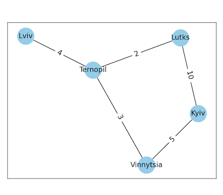
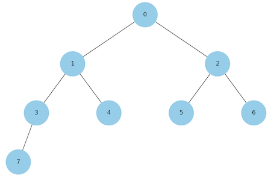
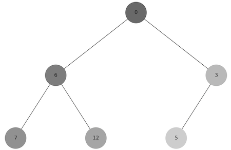
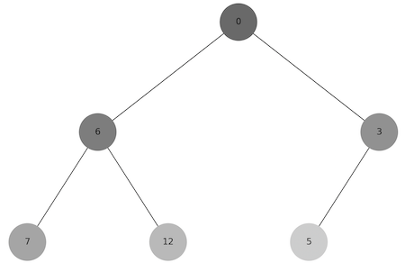

# Фінальний проєкт

Перед виконанням встановіть залежності, якщо треба.

```
pip install -r requirements.txt
```

## Залежності

-   matplotlib
-   networkx
-   numpy

## Завдання 1. Структури даних. Сортування. Робота з однозв'язним списком

Для реалізації однозв'язного списку (приклад реалізації можна взяти з конспекту) необхідно:

-   написати функцію, яка реалізує реверсування однозв'язного списку, змінюючи посилання між вузлами;
-   розробити алгоритм сортування для однозв'язного списку, наприклад, сортування вставками або злиттям;
-   написати функцію, що об'єднує два відсортовані однозв'язні списки в один відсортований список.

### Виконання

Домашнє завдання виконано у файлі task_1.py.

### Приклад запуску програми

```
python task_1.py
```

### Приклад роботи програми

Запуск програми

```
python task_1.py
```

Результат виконання

```
Створюємо однозв'язний список
Добавляємо вузли на початок: 3, 11, 12
Добавляємо вузли у кінець: 22, 26
Вузли до реверсування:
12 => 11 => 3 => 22 => 26
Робимо реверсування
Вузли після реверсування:
26 => 22 => 3 => 11 => 12
Робимо сортування
3 => 11 => 12 => 22 => 26

Об'єднання двох однозв'язних списків
Створюємо перший однозв'язний список з вузлами: 1, 3, 5
1 => 3 => 5
Створюємо другий однозв'язний список з вузлами: 2, 4, 6
2 => 4 => 6
Робимо обʼєднання
1 => 2 => 3 => 4 => 5 => 6
```

## Завдання 2. Рекурсія. Створення фрактала “дерево Піфагора” за допомогою рекурсії

Необхідно написати програму на Python, яка використовує рекурсію для створення фрактала “дерево Піфагора”. Програма має візуалізувати фрактал “дерево Піфагора”, і користувач повинен мати можливість вказати рівень рекурсії.

### Виконання

Домашнє завдання виконано у файлі task_2.py.

Наступні параметри будуть використані за замовчуванням, якщо не було передано з командного рядку жодного:

-   рівень рекурсії: 10

### Приклад запуску програми

```
python task_2.py [рівень рекурсії]
```

```
python task_2.py
python task_2.py 10
```

### Приклад роботи програми

Рівень рекурсії 4

```
python task_2.py 4
```



Рівень рекурсії 6

```
python task_2.py 6
```



Рівень рекурсії 10

```
python task_2.py 10
```



## Завдання 3. Дерева, алгоритм Дейкстри

Розробіть алгоритм Дейкстри для знаходження найкоротших шляхів у зваженому графі, використовуючи бінарну купу. Завдання включає створення графа, використання піраміди для оптимізації вибору вершин та обчислення найкоротших шляхів від початкової вершини до всіх інших.

### Виконання

Домашнє завдання виконано у файлі task_3.py.

При виконанні завдання був використана наступна структура даних:

```
{
  "Kyiv": {"Vinnytsia": 5, "Lutks": 10},
  "Vinnytsia": {"Kyiv": 5, "Ternopil": 3},
  "Lutks": {"Kyiv": 10, "Ternopil": 2},
  "Ternopil": {"Vinnytsia": 3, "Lutks": 2, "Lviv": 4},
  "Lviv": {"Ternopil": 4},
}
```

### Приклад роботи програми

Запуск програми

```
python task_3.py
```

Результат виконання

```
Початкова вершина Kyiv
Kyiv: 0 Vinnytsia: 5 Lutks: 10 Ternopil: 8 Lviv: 12
Найкоротших шляхів від початкової вершини Kyiv до всіх інших складає: 35
```



## Завдання 4. Візуалізація піраміди

Використовуючи код завдання як базу, побудуйте функцію, що буде візуалізувати бінарну купу.

### Виконання

Домашнє завдання виконано у файлі task_4.py. Фукнція `draw_heap_tree`.

Наступні параметри будуть використані за замовчуванням, якщо не було передано з командного рядку жодного:

-   список вузлів: [0, 1, 2, 3, 4, 5, 6, 7]

### Приклад запуску програми

```
python task_4.py [список вузлів]
```

```
python task_4.py
python task_4.py 0,1,2,3,4,5,6,7
```

### Приклад роботи програми

Запуск програми

```
python task_4.py
```

Результат виконання



## Завдання 5. Візуалізація обходу бінарного дерева

Використовуючи код із завдання 4 для побудови бінарного дерева, необхідно створити програму на Python, яка візуалізує обходи дерева: у глибину та в ширину.

Вона повинна відображати кожен крок у вузлах з різними кольорами, використовуючи 16-систему RGB (приклад #1296F0). Кольори вузлів мають змінюватися від темних до світлих відтінків, залежно від послідовності обходу. Кожен вузол при його відвідуванні має отримувати унікальний колір, який візуально відображає порядок обходу.

### Виконання

Домашнє завдання виконано у файлі task_5.py.

Під час виконання завдання було задіяне наступне дерево:

```
root = Node(0)
root.left = Node(6)
root.left.left = Node(7)
root.left.right = Node(12)
root.right = Node(3)
root.right.left = Node(5)
```

### Приклад роботи програми

Запуск програми

```
python task_5.py
```

Результат виконання обходу дерева у глибину



Результат виконання обходу дерева у ширину



## Завдання 6: Жадібні алгоритми та динамічне програмування

Необхідно написати програму на Python, яка використовує два підходи — жадібний алгоритм та алгоритм динамічного програмування для розв’язання задачі вибору їжі з найбільшою сумарною калорійністю в межах обмеженого бюджету.

Кожен вид їжі має вказану вартість і калорійність. Дані про їжу представлені у вигляді словника, де ключ — назва страви, а значення — це словник з вартістю та калорійністю.

```
items = {
  "pizza": {"cost": 50, "calories": 300},
  "hamburger": {"cost": 40, "calories": 250},
  "hot-dog": {"cost": 30, "calories": 200},
  "pepsi": {"cost": 10, "calories": 100},
  "cola": {"cost": 15, "calories": 220},
  "potato": {"cost": 25, "calories": 350}
}
```

Розробіть функцію greedy_algorithm жадібного алгоритму, яка вибирає страви, максимізуючи співвідношення калорій до вартості, не перевищуючи заданий бюджет.

Для реалізації алгоритму динамічного програмування створіть функцію dynamic_programming, яка обчислює оптимальний набір страв для максимізації калорійності при заданому бюджеті.

### Виконання

Домашнє завдання виконано у файлі task_6.py.

Наступні параметри будуть використані за замовчуванням, якщо не було передано з командного рядку жодного:

-   обмеження бюджету: 75

### Приклад запуску програми

```
python task_6.py [обмеження бюджету]
```

```
python task_6.py
python task_6.py 75
```

### Приклад роботи програми

Запуск програми

```
python task_6.py
```

Результат виконання

```
Обмеження бюджету: 75
Жадібний алгоритм:
Обрані елементи їжі: ['cola', 'potato', 'pepsi']
Загальна вартість: 50
Загальна кількість калорій: 670

Динамічний алгоритм:
Обрані елементи їжі: ['hot-dog', 'potato', 'cola']
Загальна вартість: 70
Загальна кількість калорій: 770
```
